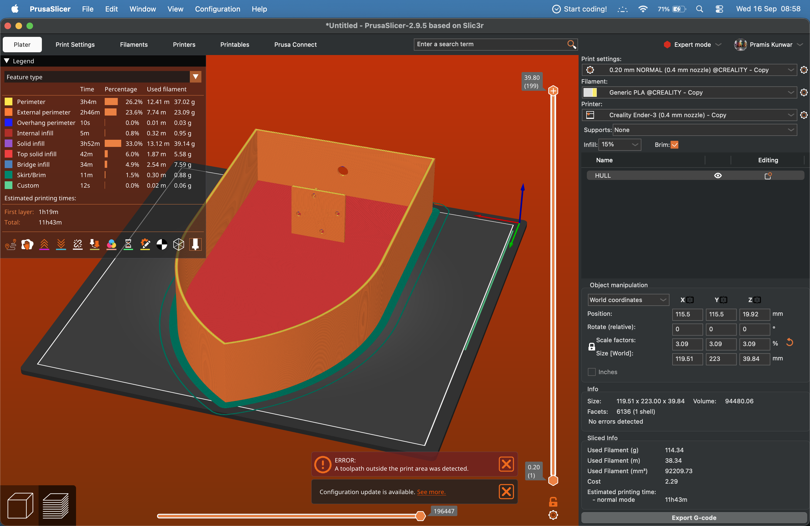

# Development Journal — RC Boat CAD
---

## Week 1 — Sept 14-20, 2026

### Goal
Make the whole RC boat (hull + propeller + internals) and put everything together in Onshape.

### Person A — Propeller (53 min)

**What I did:**
- Made a new Part Studio for the propeller
- Sketched the hub and revolved it
- Sketched 2 offset blade cross sections and used **Loft** to get a twisted blade
- Used **Circular Pattern** (3x) around the hub axis
- Added a 3 mm bore for the shaft coupling
- Filleted the blade edges so it looks smoother

**Challenges:**
- First time the blade loft twisted the wrong way lol, fixed it by reordering the sketch planes
- Blade tip was too thin so I added a small thickness offset

**Tools used:** Onshape (Loft, Revolve, Circular Pattern, Fillet)
**Time logged:** 0.88 hours (53 min) via Lapse

---

### Person B — Hull, Deck, Motor Mount, Assembly (2h 21 min)

**What I did:**
- Sketched 4 cross section stations along the hull centerline
- Used **Loft** to make a smooth hull body
- Used **Shell** to hollow it out with 2 mm walls
- Made the **deck plate** as a separate part (the pink one)
- Designed a **cross shaped motor mount** with 4x M3 holes
- Modeled the **shaft** (3 mm rod) and the coupling
- Added electronics:
  - Li-Po battery (blue box)
  - ESC / servo (blue module)
  - Motor + the yellow bracket
- Put everything in the **Assembly tab** with mates:
  - Fastened: motor mount to hull
  - Fastened: motor to mount
  - Revolute: propeller to shaft
  - Fastened: battery + servo to hull floor

---

### Images

| Hull  | Lid  |
| :---: | :---: |
|  |  |

| Assembly  | Slicer  |
| :---: | :---: |
|  |  |

---

**Challenges:**
- Hull was too narrow at the stern so I had to fix station 4
- Motor mount hole spacing had to match the motor, measured twice cut once
- Assembly mates kept flipping on me, fixed it by adding an axis mate

**Tools used:** Onshape (Loft, Shell, Extrude, Fillet, Assembly mates)
**Time logged:** 2.35 hours (2h 21 min) via Lapse

---

### Ship of the Week

- **Repo:** [github.com/ArchanaKunwar/THIRD-SPACE-BOAT](https://github.com/ArchanaKunwar/THIRD-SPACE-BOAT)
- **Onshape doc:** https://cad.onshape.com/documents/000ae551268fb42816427738/w/8f4ce627ee08794ee4e8480f/e/ccb63d3aac4362792a76f92b?renderMode=0&uiState=6aaa0f6545a0f105887e1b49
- **Combined hours this week:** 3.23 hours
- **Team total this week:** 3.23 / 20 hours

---
